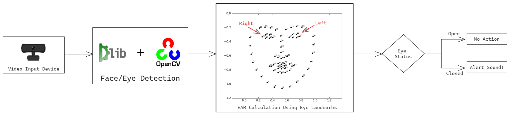

# Driver Drowsiness Alert System

This project implements a driver drowsiness detection system using computer vision techniques. The system captures video from a webcam, detects the driver's face and eyes, and calculates the Eye Aspect Ratio (EAR) to determine if the eyes are closed. If the eyes remain closed for a specified duration, an alert is triggered.

## Features
- Real-time face and eye detection using dlib and OpenCV.
- Audio alert using text-to-speech if the driver appears drowsy.

## Libraries Used
- dlib for face and landmark detection.
- opencv for computer vision functionalities.
- pyttsx3 for text-to-speech conversion.
